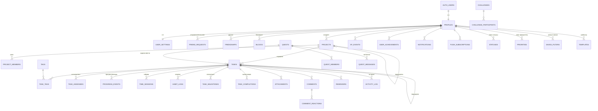

# Veritas Tasks — план разработки

> Статус: **на утверждении** · версия 1 · 29.09.2026
> Документ описывает, что и как я построю. Код начну писать только после вашего «утверждаю».

---

## 0. Коротко и простыми словами

**Что строим.** Veritas Tasks — это планировщик задач в космическом стиле: задачи становятся звёздами, проекты — планетами, общие цели с друзьями — созвездиями. Работает на компьютере и телефоне, устанавливается как приложение, работает без интернета, говорит на русском, английском и болгарском.

**Из чего состоит:**

1. **Сайт-приложение** (Next.js + React). Это всё, что видит пользователь: экраны, анимации, 3D, звуки.
2. **Сервер** (Supabase, бесплатный тариф): база данных, вход по почте, хранение файлов, живые обновления между друзьями, отправка уведомлений по расписанию.
3. **Копия данных на устройстве** (IndexedDB). Интерфейс читает и пишет данные сначала у себя, поэтому всё происходит мгновенно и работает офлайн. В фоне изменения синхронизируются с сервером.

**Как буду работать.** 14 этапов (раздел 15). После каждого этапа: запуск, линтер, проверка типов, тесты, скриншоты на ПК и телефоне, строгий дизайн-разбор в `DESIGN_REVIEW.md`, исправления, коммит и короткий отчёт вам на русском.

**Что нужно от вас сейчас:** прочитать план и ответить на вопросы из раздела 18. Самое главное — «утверждаю» или ваши правки.

---

## 1. Что я проверил в своём рабочем окружении

Перед планом проверил, что реально можно сделать в облачном окружении, где я работаю. От этого зависят тесты, запись демо и деплой.

| Что проверил | Результат | Что это значит |
|---|---|---|
| Node.js 22, npm | есть | можно собирать проект |
| Docker | запускается | могу поднять у себя полную копию Supabase |
| Локальный Supabase: Postgres 17, вход, Realtime, файлы, Edge Functions, почтовый ящик для тестовых писем | **поднял пробно, все сервисы ответили** | вся разработка, тесты правил доступа, e2e-тесты и запись демо идут на этой копии и не трогают вашу боевую базу |
| Расширения Postgres: `pg_cron`, `pg_net`, `pg_jsonschema`, `pgtap`, `citext`, `pg_trgm` | все доступны | расписания, HTTP из базы, проверка JSON, тесты на SQL |
| Доступ из окружения к `supabase.co` и `vercel.com` | **закрыт сетевой политикой** | открыть боевой сайт через интернет я сам не могу. Но ваш аккаунт Supabase подключён ко мне официальным коннектором: через него могу создать проект, применить миграции и развернуть функции (только с вашего разрешения). Vercel вы подключите сами в 3–4 клика по гайду |
| Ваш аккаунт Supabase | 2 проекта: «Minorq5's Project» и «VeritasBio», **оба на паузе** | бесплатно можно держать 2 активных проекта, приостановленные не считаются. Для Veritas Tasks предлагаю создать новый бесплатный проект (спрошу перед созданием) |
| Видеокарта | нет (облачный сервер) | 3D рисуется программно и медленнее. Поэтому демо-видео пишу покадрово с «виртуальным временем»: каждый кадр рендерится столько, сколько нужно, а в ролике всё идёт ровно 60 кадров/с |
| Chromium для Playwright | есть | скриншоты, e2e-тесты, запись видео |
| ffmpeg | системного нет | поставлю (apt или npm-пакет со статической сборкой) |

---

## 2. Архитектура

### 2.1 Общая схема

```
┌──────────────────────── Браузер / установленное PWA ────────────────────────┐
│  Интерфейс: Next.js (React 19) · Tailwind · Motion · GSAP · 3D (Three.js)     │
│        │  мгновенно                                                           │
│  Локальная база (IndexedDB / Dexie): все данные пользователя + очередь        │
│        │  изменений                                                           │
│  Движок синхронизации: отправка очереди · приём изменений · слияние          │
│  конфликтов · Realtime-подписки · присутствие («кто онлайн, кто что правит») │
│  Service Worker: офлайн-оболочка, кэш, приём push-уведомлений                 │
└──────────────┬───────────────────────────────────────────────────────────────┘
               │ HTTPS (ключ только публичный, права проверяет база)
┌──────────────▼──────────────────── Supabase (бесплатно) ─────────────────────┐
│  Auth — регистрация, вход, письма, сессии                                     │
│  Postgres + RLS — данные и правила доступа на каждой таблице                  │
│  SQL-функции и триггеры — XP, достижения, история, лимиты, уведомления        │
│  Realtime — живые изменения и присутствие                                     │
│  Storage — аватары и вложения                                                 │
│  Edge Functions — отправка push, удаление аккаунта, ночное обслуживание       │
│  pg_cron — расписания (напоминания каждую минуту, очистка корзины и т.д.)    │
└──────────────┬───────────────────────────────────────────────────────────────┘
               │ Web Push (VAPID)
        Push-службы браузеров (Google, Apple, Mozilla, Microsoft)

Vercel (бесплатно) — раздаёт готовые страницы сайта через CDN.
```

### 2.2 Ключевые решения и почему

1. **Сначала локально (local-first).** Каждое действие сразу записывается в локальную базу на устройстве, а интерфейс показывает результат мгновенно. Сервер получает изменения в фоне. Так мы выполняем требование «интерфейс никогда не ждёт» и получаем полноценный офлайн без отдельного режима.
2. **Вся безопасность и серверная логика — в Supabase:** правила RLS, SQL-функции, триггеры, Edge Functions. Next.js только отдаёт страницы. Поэтому секретный ключ не попадает ни в браузер, ни даже на Vercel: он живёт только внутри Supabase.
3. **Язык в адресе страницы** (`/ru/today`, `/en/today`, `/bg/today`). Страницы собираются заранее и раздаются с CDN, поэтому открываются мгновенно, легко работают офлайн и хорошо оцениваются Lighthouse. Корень `/` сам выбирает язык по браузеру или по сохранённому выбору.
4. **3D — отдельный слой.** Он грузится после интерфейса и никогда не мешает работе с задачами. На странице один общий WebGL-холст, в котором рисуются все мелкие 3D-объекты: планеты в списке проектов, значки достижений. Браузеры ограничивают число 3D-холстов примерно до 16, и такой подход обходит этот лимит.
5. **Звуки синтезируются кодом (Web Audio).** Никаких чужих файлов и лицензий, мгновенная загрузка, все звуки в одной тональности. Тот же код умеет «отрендерить» звук в WAV для демо-видео.
6. **Одна схема проверки данных (zod)** работает в браузере, в Edge Functions и в самой базе: схемы автоматически превращаются в JSON Schema и проверяются в Postgres через `pg_jsonschema`.
7. **Свои модули для повторений и умной строки.** Готовые библиотеки не знают болгарский, а русский знают частично. Свои модули полностью покрыты тестами на трёх языках.

### 2.3 Технологии

| Задача | Выбор | Комментарий |
|---|---|---|
| Фреймворк | **Next.js 16** (App Router, Turbopack), **React 19**, **TypeScript strict** | актуальные стабильные версии на сегодня |
| Стили | **Tailwind CSS v4** + дизайн-токены в CSS-переменных | цвета, отступы, радиусы, тени, свечения, длительности |
| Анимации интерфейса | **Motion** (это новое имя Framer Motion, тот же автор и API) | пружины, shared layout, жесты |
| Сложная хореография | **GSAP 3 + ScrollTrigger + SplitText** | с 2025 года все плагины GSAP бесплатны |
| Плавный скролл лендинга | **Lenis** | только на лендинге |
| 3D | **Three.js + React Three Fiber 9 + drei 10 + @react-three/postprocessing** | свои GLSL-шейдеры, instancing |
| Сервер | **Supabase**: Postgres 17, Auth, Realtime, Storage, Edge Functions, pg_cron, pg_net | всё на бесплатном тарифе |
| Данные на клиенте | **Dexie** (IndexedDB) + свой движок синхронизации | офлайн, очередь, конфликты |
| Серверные запросы без офлайна | **TanStack Query** | таблица лидеров, поиск людей, публичные профили |
| Состояние интерфейса | **Zustand** | выделение, панели, настройки устройства |
| Проверка данных | **zod 4** → JSON Schema → `pg_jsonschema` | одна схема на клиенте, в функциях и в базе |
| Перетаскивание | **dnd-kit** (стабильные `@dnd-kit/core` + `sortable`) | мышь, палец, клавиатура. Новый `@dnd-kit/react` пока в версии 0.x, поэтому не беру |
| Переводы | **next-intl 4** (ICU: множественное число, даты, числа) | ru / en / bg |
| Графики | **Recharts 3**, полностью перестилизованный, + свои SVG-компоненты | тепловые карты, кольца, спарклайны — свои |
| Звук | **Web Audio API**, свой движок без Howler и Tone.js | ~10 КБ вместо сотен, полный контроль, офлайн-рендер для видео |
| Текстовый редактор описания | **Tiptap 3** (MIT-часть) | жирный, курсив, списки, чек-листы, ссылки, код |
| Поведение и доступность компонентов | **Radix UI** (без стилей), **vaul** (bottom sheet), **cmdk** (палитра) | только логика и доступность, весь вид свой. Это не «готовая UI-библиотека», а невидимый фундамент |
| Иконки | **Lucide** + собственные SVG-иконки бренда | |
| Поиск | **MiniSearch** на устройстве | мгновенно и офлайн, с подсветкой совпадений |
| Порядок элементов | **fractional-indexing** | перестановка меняет одну запись, удобно для офлайна |
| PWA | **Serwist** (преемник next-pwa / Workbox) | |
| QR | `qrcode` (генерация), `BarcodeDetector` + `jsQR` (сканирование камерой) | |
| Обрезка аватара | `react-easy-crop` → WebP в браузере | на бесплатном тарифе Supabase нет серверной обработки картинок |
| Даты | `date-fns 4` + `@date-fns/tz` + Intl | часовые пояса, локали |
| Тесты | **Vitest** (логика), **pgTAP** (правила базы), **Playwright** (e2e, скриншоты, видео), **axe-core** (доступность), **Lighthouse** | |
| Качество кода | ESLint (next, react-hooks, jsx-a11y) + Prettier | 0 ошибок и 0 предупреждений после каждого этапа |
| Деплой | **Vercel Hobby** + **Supabase Free** | |

### 2.4 Синхронизация и конфликты

Это сердце офлайн-режима, поэтому опишу подробно.

- **Локальная база на пользователя.** Для каждого аккаунта своя база IndexedDB (`veritas-<userId>`), поэтому данные разных людей на одном устройстве не смешиваются. При выходе из аккаунта локальная база очищается.
- **Идентификаторы создаёт клиент** (UUID v7). Задачу можно создать офлайн, а её подзадачи, теги и вложения ссылаются на неё сразу.
- **Очередь изменений (outbox).** Любое действие: (1) меняет запись локально, (2) кладёт в очередь «что изменилось + какие были значения до + версия записи», (3) кладёт обратное действие в стек Undo. Несколько правок одной записи подряд склеиваются.
- **Отправка.** Когда есть сеть, очередь уходит на сервер. Обновление выполняется с проверкой версии: «обнови, если версия всё ещё N».
- **Конфликт** (запись уже изменили на другом устройстве или другой человек). Выполняется слияние по полям в три шага: база → моя версия → серверная версия.
  - если поле менял только я — берём моё;
  - если поле менял только другой — берём его;
  - если оба поменяли одно поле — побеждает более позднее изменение, а проигравшее значение сохраняется в истории задачи. Его можно вернуть одной кнопкой. Пользователь видит спокойное уведомление «Задача изменена на другом устройстве — применена более новая версия».
- **Прогресс без конфликтов.** Счётчики, числовые цели, таймеры, вклады в совместные задачи и отметки привычек хранятся как **события** («+1», «+25 страниц», «сессия 25 мин»), а не как перезаписываемое число. Два офлайн-устройства, сделавшие «+1», дадут «+2», а не потерянное значение.
- **Приём изменений:** Realtime-подписки (мгновенно) + дозапрос изменений по отметке времени (при запуске, при появлении сети, раз в минуту) + периодическая сверка списка ID (удаляет у себя то, к чему пропал доступ, например если вас убрали из проекта).
- **Вложения офлайн.** Файл сохраняется в IndexedDB и загружается, когда появится сеть.
- **Индикатор:** «Синхронизировано» / «Синхронизация…» / «Офлайн — N изменений ждут отправки» / «Ошибка — повторим через…».

### 2.5 Безопасность

- RLS включён на **всех** таблицах, в публичной схеме нет ни одной таблицы без политик. У анонимного пользователя доступа к данным нет, кроме функции проверки занятости username.
- Функции с повышенными правами (`security definer`) лежат в закрытой схеме `private`, у каждой зафиксирован `search_path`.
- Защищённые поля (XP, уровень, публичный ID, владелец) нельзя изменить с клиента: права на столбцы + защитные триггеры.
- Секретный ключ Supabase используется только внутри Edge Functions и в локальных скриптах `seed`. В браузер и на Vercel он не попадает.
- Лимиты частоты в базе: заявки в друзья, комментарии, сообщения квестов, реакции, приглашения, проверка username. Встроенные лимиты Supabase Auth на регистрацию и вход. Опционально CAPTCHA Cloudflare Turnstile (бесплатно).
- Проверка данных zod в браузере и в Edge Functions. В базе — CHECK-ограничения и `pg_jsonschema`.
- Заголовки безопасности: CSP, Referrer-Policy, Permissions-Policy (камера только для QR), запрет встраивания в iframe.
- Защита от XSS: описание хранится как структурированный JSON Tiptap, а не как HTML. Ссылки открываются только с разрешёнными протоколами и `rel="noopener noreferrer"`.
- Вложения лежат в закрытом хранилище и открываются по временным подписанным ссылкам.

### 2.6 Производительность и доступность

- Страницы собираются заранее, код делится по маршрутам. 3D, редактор, графики и звук подгружаются лениво, после того как интерфейс уже работает.
- Длинные списки виртуализированы (`@tanstack/react-virtual`).
- Шрифты: подмножества кириллица + латиница, предзагружаются только нужные начертания.
- Рендер 3D останавливается во вкладке без фокуса и вне экрана. Плотность пикселей ограничена на телефонах. При падении FPS качество снижается автоматически.
- Системная настройка «уменьшить движение»: параллакс, частицы и перелёты заменяются мягким растворением.
- Клавиатура везде, видимый фокус, aria-метки, объявления для экранного диктора (в том числе при перетаскивании), контраст текста WCAG AA. Контраст всех пар «текст/фон» из токенов проверяется автоматическим тестом.
- Цели Lighthouse для внутренних страниц: производительность ≥ 85 на мобильных, доступность ≥ 95.

---

## 3. Структура папок

```
veritas-tasks/
├─ PLAN.md · README.md · SETUP_GUIDE.md · DESIGN_SYSTEM.md · DESIGN_REVIEW.md · SOUND_CREDITS.md
├─ .env.example
├─ package.json · tsconfig.json · next.config.ts · eslint.config.mjs · vitest.config.ts · playwright.config.ts
├─ public/
│  ├─ brand/             логотип (знак, знак+надпись), OG-картинка
│  └─ icons/             фавиконы, иконки PWA всех размеров, maskable, apple-touch, заставки iOS
├─ src/
│  ├─ app/
│  │  ├─ layout.tsx · manifest.ts · robots.ts · sitemap.ts · sw.ts (service worker)
│  │  └─ [locale]/                         ru | en | bg
│  │     ├─ page.tsx                       интро + лендинг (гости) / переход в приложение
│  │     ├─ (auth)/                        login · register · forgot-password · reset-password · confirm · check-email
│  │     ├─ (app)/                         всё приложение (оболочка: боковая панель / нижняя навигация)
│  │     │  ├─ onboarding/
│  │     │  ├─ inbox · today · tomorrow · week · overdue · completed · trash
│  │     │  ├─ tasks/[taskId]              полноэкранная задача (+ перехват маршрута для раскрытия из карточки)
│  │     │  ├─ projects/ · projects/[id] · projects/archive
│  │     │  ├─ tags/[id] · lists/[id] · search
│  │     │  ├─ calendar · timeline · galaxy
│  │     │  ├─ friends/ · u/[username] · quests/ · quests/[id] · star-map · challenges/ · challenges/[id]
│  │     │  ├─ stats · achievements · leaderboard · activity · notifications
│  │     │  └─ profile · settings/[section]
│  │     ├─ design/                        витрина дизайн-системы (только в режиме разработки)
│  │     ├─ offline/
│  │     └─ not-found.tsx · error.tsx
│  ├─ components/
│  │  ├─ ui/          базовые компоненты: кнопки, поля, меню, диалоги, sheet, toast, аватары, кольца…
│  │  ├─ brand/       логотип, собственные иконки
│  │  ├─ layout/      оболочка, боковая панель, нижняя навигация, шапки, индикатор синхронизации
│  │  └─ effects/     курсор, магнитные кнопки, свечение под курсором, зерно, волна
│  ├─ features/
│  │  ├─ auth · onboarding · profile · settings
│  │  ├─ tasks/       список, строка, карточка, экран задачи, создание, типы/*, умная строка,
│  │  │               массовые действия, история, вложения, комментарии, напоминания, повторения
│  │  ├─ projects · tags · filters · search · palette
│  │  ├─ views/       list · kanban · calendar · timeline · galaxy
│  │  ├─ social/      друзья, заявки, QR, присутствие
│  │  ├─ quests · challenges · notifications · activity
│  │  ├─ gamification/  XP, уровни, достижения, лидеры, сцена уровня
│  │  ├─ stats · pwa · data (экспорт/импорт) · shortcuts
│  │  └─ demo/        режим записи демо: видимый курсор, точки касаний, журнал звуков, титры
│  ├─ three/
│  │  ├─ core/        общий холст, View-порталы, менеджер качества, монитор FPS, пауза
│  │  ├─ shaders/     nebula · stars · planet-surface · clouds · atmosphere · rings · portal ·
│  │  │               hyperjump · particles · godrays · starfield-bg (*.glsl)
│  │  ├─ scenes/      intro · landing · auth-planet · background · galaxy · planet · constellation ·
│  │  │               orbits · supernova · level-up · badge · astronaut · lost-404 · splash
│  │  └─ lib/         точки из логотипа, пуассон-диск, раскладки, шум
│  ├─ sound/          движок, синтезаторы, «патчи» звуков, эмбиент, офлайн-рендер
│  ├─ lib/
│  │  ├─ supabase/    клиент, сгенерированные типы
│  │  ├─ db/          схема Dexie, репозитории
│  │  ├─ sync/        движок, очередь, приём, Realtime, слияние, сверка
│  │  ├─ domain/      прогресс типов, повторения, XP, уровни, серии, достижения, умная строка,
│  │  │               фильтры, сортировка
│  │  ├─ validation/  схемы zod (→ JSON Schema для базы)
│  │  ├─ io/          экспорт JSON / CSV / ICS, импорт
│  │  └─ i18n · hotkeys · haptics · motion · utils
│  ├─ stores/         Zustand
│  ├─ messages/       ru.json · en.json · bg.json
│  ├─ styles/         tokens.css · globals.css
│  └─ proxy.ts        выбор языка и перенаправление неавторизованных (в Next 16 так называется middleware)
├─ supabase/
│  ├─ config.toml
│  ├─ migrations/     вся схема базы — применяется одной командой
│  ├─ functions/      push-dispatch · maintenance · delete-account · _shared
│  ├─ tests/          pgTAP: правила доступа и триггеры
│  └─ seed.sql
├─ scripts/
│  ├─ seed-demo.ts · gen-icons.ts · gen-json-schemas.ts · check-contrast.ts · screenshots.ts · lighthouse.ts
│  └─ demo/           сценарии Playwright, покадровый захват, звук, монтаж, трейлеры, проверка кадров
├─ tests/             unit/ · e2e/
├─ docs/review/       финальные скриншоты каждого этапа (сжатые)
└─ demo/              готовые видео
```

---

## 4. База данных

### 4.1 Общие правила

- У каждой таблицы: `id uuid`, `created_at`, `updated_at` (обновляет триггер). У синхронизируемых таблиц ещё `version` (растёт при каждом изменении) и `deleted_at` (мягкое удаление: корзина и сигнал для синхронизации).
- Внешние ключи с индексами. Удаление аккаунта каскадно удаляет всё, что ему принадлежит.
- Проверки в базе: длины строк, диапазоны чисел, форматы. JSON-поля (правило повторения, настройки типа) проверяются через `pg_jsonschema` по схемам, сгенерированным из zod.
- Все таблицы, нужные для живых обновлений, добавлены в публикацию `supabase_realtime`.
- Политики RLS написаны по рекомендациям Supabase для скорости: `(select auth.uid())`, вспомогательные функции, которые возвращают набор ID и считаются один раз на запрос.

### 4.2 Схема связей (основное)



### 4.3 Таблицы и правила доступа (RLS)

Сокращения в колонке RLS: **R** — чтение, **C** — создание, **U** — изменение, **D** — удаление. «Через функцию» означает, что прямой доступ к таблице закрыт, а действие выполняется только через проверенную SQL-функцию, которая сама проверяет права, лимиты и приватность.

#### Аккаунт и люди

| Таблица | Главные поля | RLS |
|---|---|---|
| `profiles` | `id` (= пользователь), `username` (citext, уникальный, 3–24 символа `a-z 0-9 _`), `display_name`, `bio`, `avatar_path`, `public_id` (`VT-4F9K2`, уникальный), `xp`, `level`, `current_streak`, `best_streak`, `last_seen_at`, `searchable` | **R:** сам; друзья; люди со взаимной заявкой; участники общих проектов, квестов и челленджей. Остальные видят минимум через функцию поиска. **U:** сам и только разрешённые поля (имя, био, аватар, username). **C:** триггер при регистрации. **D:** удаление аккаунта |
| `user_settings` | акцентный цвет, звук и громкости (общая, интерфейс, эффекты, эмбиент), язык, часовой пояс, начало недели, формат времени, уменьшение движения, виброотклик, настройки уведомлений (типы, тихие часы, время утренней сводки), приватность (кто может добавлять в друзья: все / друзья друзей / никто; показывать ли меня в лидерах), отметки онбординга | **R/C/U/D:** только сам |
| `friend_requests` | `sender_id`, `receiver_id`, `status` (ожидает / принята / отклонена / отменена), `responded_at` | **R:** отправитель и получатель. **C/U:** через функции `send_friend_request`, `respond_friend_request`, `cancel_friend_request`: проверка приватности, блокировок, дублей и лимита частоты |
| `friendships` | `user_id`, `friend_id` (две симметричные строки на дружбу) | **R:** свои строки. **C:** триггер при принятии заявки. **D:** через функцию `remove_friend` (удаляет обе строки) |
| `blocks` | `blocker_id`, `blocked_id` | **R/C/D:** только тот, кто блокирует. Заблокированный о блокировке не узнаёт |

Качество графики, свой курсор и громкость **на конкретном устройстве** хранятся локально на устройстве, а не в базе: на телефоне и на ПК они обычно разные.

#### Задачи и организация

| Таблица | Главные поля | RLS |
|---|---|---|
| `projects` | `owner_id`, `parent_id` (подпроекты), `name`, `description`, `color`, `icon`, `planet_seed`, `sort_key`, `archived_at`, `view_settings` | **R:** участники проекта. **C:** сам себе, владелец добавляется автоматически. **U:** владелец и редакторы (владельца менять нельзя). **D:** мягко — владелец; окончательно — ночная очистка |
| `project_members` | `project_id`, `user_id`, `role` (владелец / редактор / наблюдатель), `status` (приглашён / участник) | **R:** участники проекта. **C:** владелец приглашает только друзей (через функцию). **U:** владелец меняет роли, приглашённый принимает. **D:** владелец исключает, участник выходит сам |
| `statuses` | `owner_id`, `project_id` (своя схема статусов у общего проекта), `system_key` (todo / in_progress / paused / done / cancelled), `name`, `color`, `category`, `sort_key` | **R:** владелец и участники его общих проектов. **C/U/D:** владелец |
| `priorities` | `owner_id`, `system_key` (critical / high / medium / low), `name`, `color`, `rank` | как у статусов |
| `tags` | `owner_id`, `name`, `color` | **R:** владелец или тег висит на видимой задаче. **C/U/D:** владелец |
| `tasks` | `owner_id`, `project_id` (пусто → «Входящие»), `parent_id` (подзадачи любой вложенности), `quest_id`, `type`, `title`, `description` (JSON Tiptap), `description_text`, `status_id`, `priority_id`, `color`, `icon`, `start_date/start_time`, `due_date/due_time`, `timezone`, `start_at/due_at` (вычисляет триггер), `estimate_minutes`, `spent_seconds`, `progress` (0–1, кэш), `progress_current`, `progress_target`, `progress_unit`, `type_config` (JSON), `recurrence` (JSON), `completed_at`, `completed_by`, `sort_key`, `deleted_at`, `deleted_by`, `version` | **R:** владелец, участники проекта, исполнители, участники квеста. **C:** сам + (проект — где я владелец или редактор) + (квест — где я участник). **U:** владелец, редакторы проекта, участники квеста; исполнитель — только статус, прогресс и выполнение (проверяет триггер). Наблюдатель — только чтение. **D:** мягко через `deleted_at`; окончательно — ночная очистка через 30 дней |
| `task_tags` | `task_id`, `tag_id` | **R:** кто видит задачу. **C/D:** кто может править задачу, и только своими тегами |
| `task_assignees` | `task_id`, `user_id`, `status` (ожидает / принял / отклонил), `assigned_by` | **R:** кто видит задачу. **C:** через `assign_task` (только друзья или участники проекта). **U:** исполнитель принимает или отклоняет. **D:** назначивший или сам исполнитель. Передача задачи — функция `transfer_task` (новый владелец должен принять) |
| `progress_events` | `task_id`, `user_id`, `kind` (set / delta / contribution), `value`, `note`, `occurred_at` | **R:** кто видит задачу. **C:** кто может править задачу, `user_id` = я. **D:** своё событие (для Undo). Изменения нет — только новые события |
| `time_sessions` | `task_id`, `user_id`, `started_at`, `ended_at`, `seconds`, `kind` (фокус / перерыв / вручную), `pomodoro_index` | **R:** кто видит задачу. **C/U/D:** свои сессии |
| `habit_logs` | `task_id`, `user_id`, `date`, `status` (выполнено / пропуск / заморозка / срыв), `value` | **R:** кто видит задачу. **C/U/D:** свои. Триггер: заморозка не чаще 1 раза в неделю на привычку |
| `task_milestones` | `task_id`, `title`, `weight` (%), `done_at`, `due_date`, `sort_key` | **R:** кто видит задачу. **C/U/D:** кто может править задачу. Используется типами «Этапная» и «Цепочка» |
| `task_completions` | `task_id`, `user_id`, `occurrence_date`, `completed_at`, `on_time`, `xp_awarded`, `priority_rank`, `project_id`, `task_type` | **R:** кто видит задачу. **C:** сам, при выполнении (XP начисляет триггер). **D:** сам (Undo — триггер отзывает XP). Это главный источник статистики |
| `attachments` | `task_id`, `uploader_id`, `storage_path`, `file_name`, `mime`, `size_bytes`, `width`, `height`, `thumb_path` | **R:** кто видит задачу. **C:** кто может править задачу + проверка квоты. **D:** загрузивший или владелец задачи |
| `comments` | `task_id`, `author_id`, `body`, `mentions uuid[]`, `edited_at`, `deleted_at` | **R:** кто видит задачу. **C:** кто видит задачу (наблюдатели тоже могут комментировать) + лимит частоты. **U/D:** автор; удалить может и владелец задачи |
| `comment_reactions` | `comment_id`, `user_id`, `kind` (звезда / ракета / сердце / огонь / смех / плюс — собственные иконки, не эмодзи) | **R:** кто видит комментарий. **C/D:** свои |
| `reminders` | `task_id`, `user_id`, `kind` (за N до дедлайна / в точное время), `offset_minutes`, `remind_at` (вычисляет триггер), `sent_at` | **R/C/U/D:** свои напоминания на видимых задачах |
| `activity_log` | `actor_id`, `entity_type`, `entity_id`, `task_id`, `project_id`, `quest_id`, `action`, `diff` (поле: было → стало) | **R:** кто видит связанную сущность. **C:** только триггеры. Изменять и удалять нельзя |
| `templates` | `owner_id`, `kind` (задача / проект), `name`, `icon`, `payload` | только владелец. Встроенные шаблоны лежат в коде и переведены |
| `saved_filters` | `owner_id`, `name`, `icon`, `color`, `query` (JSON), `sort`, `view`, `pinned` | только владелец |

#### Квесты и челленджи

| Таблица | Главные поля | RLS |
|---|---|---|
| `quests` | `owner_id`, `title`, `description`, `icon`, `color`, `deadline`, `reward_xp`, `status` (активен / завершён / провален / в архиве), `completed_at`, `layout` (позиции звёзд созвездия), `badge_seed` | **R:** участники. **C:** сам. **U:** владелец; статус меняют триггеры |
| `quest_members` | `quest_id`, `user_id`, `role`, `status` (приглашён / участник / вышел) | **R:** участники. **C:** владелец приглашает друзей. **U:** сам принимает или выходит. **D:** владелец |
| `quest_messages` | `quest_id`, `author_id` (пусто — системное событие), `kind` (сообщение / событие), `body`, `payload` | **R:** участники. **C:** участники + лимит частоты. **U/D:** автор |
| `challenges` | `creator_id`, `title`, `metric` (выполнено задач / XP / минуты фокуса / отметки привычек), `starts_at`, `ends_at`, `status`, `winner_id` | **R:** участники и приглашённые. **C:** сам. **U:** создатель до старта |
| `challenge_participants` | `challenge_id`, `user_id`, `status` (приглашён / участвует / отказался), `final_score`, `final_rank` | **R:** участники этого челленджа. **C:** создатель приглашает друзей. **U:** сам принимает или отказывается |

Очки челленджа считаются на лету функцией из выполнений за период. Итог фиксирует задача по расписанию.

#### Геймификация, уведомления, служебное

| Таблица | Главные поля | RLS |
|---|---|---|
| `xp_events` | `user_id`, `amount`, `reason`, `task_id`, `quest_id`, `challenge_id`, уникальный ключ против двойного начисления | **R:** сам. **C:** только триггеры |
| `user_achievements` | `user_id`, `achievement_key`, `unlocked_at`, `progress`, `payload` (для уникальных значков квестов) | **R:** сам и друзья. **C:** только функции проверки достижений |
| `notifications` | `user_id`, `type`, `actor_id`, ссылки на сущности, `payload`, `read_at`, `push_status` | **R/U (прочитано)/D:** сам. **C:** только триггеры и функции |
| `push_subscriptions` | `user_id`, `endpoint` (уникальный), `p256dh`, `auth`, `device_label`, `last_used_at`, `fail_count` | только сам. Для отправки читает Edge Function |
| `private.rate_limits` | `user_id` / IP, `action`, `window_start`, `count` | закрытая схема, API её не видит |

Определения достижений и уровней лежат в коде, а не в базе: так проще переводить и версионировать. В базе хранятся только факты: что открыто и когда.

### 4.4 Функции, триггеры, расписания

**Вспомогательные функции для RLS** (схема `private`): `project_role(project)`, `my_project_ids()`, `my_assigned_task_ids()`, `my_quest_ids()`, `can_view_task(task)`, `can_edit_task(task)`, `can_manage_task(task)`, `are_friends(a, b)`, `is_blocked(a, b)`, `rate_limit(action, max, window)`.

**Функции для клиента (RPC):**
- `check_username(name)` — доступна без входа, с лимитом частоты;
- `find_user(query)` — точный поиск по `VT-XXXXX` или username, с учётом приватности и блокировок;
- друзья: `send_friend_request`, `respond_friend_request`, `cancel_friend_request`, `remove_friend`, `block_user`, `unblock_user`;
- проекты: `invite_to_project`, `set_member_role`, `leave_project`;
- задачи: `assign_task`, `respond_assignment`, `transfer_task`, `respond_transfer`;
- квесты: `create_quest`, `invite_to_quest`, `respond_quest_invite`;
- челленджи: `create_challenge`, `respond_challenge`, `challenge_scoreboard`;
- общее: `get_leaderboard(period)`, `get_public_profile(username)`.

**Триггеры:**
- создание профиля при регистрации: публичный ID, стандартные статусы, приоритеты и настройки;
- `updated_at` и `version`;
- вычисление `due_at` и `start_at` из даты, времени и часового пояса; пересчёт напоминаний при смене дедлайна;
- журнал истории (`activity_log`) для задач, проектов, квестов, комментариев, назначений, участников;
- выполнение: XP (с защитой от повторного начисления), серии, проверка достижений, прогресс квеста, завершение квеста (награда, уникальный значок, системное сообщение), уведомления;
- защитные: неизменяемые поля; ограничения для исполнителя и наблюдателя; заморозка не чаще раза в неделю; лимиты частоты;
- уведомления: заявки, принятие дружбы, назначения, упоминания, комментарии в моих задачах, приглашения в квест и челлендж, завершения.

**Хранилище (Storage):**
- `avatars` — публичное чтение, запись только в свою папку `avatars/<userId>/`, до 2 МБ, только изображения;
- `attachments` — закрытое, путь `<taskId>/<attachmentId>/<имя>`, доступ по правилам задачи, до 10 МБ на файл (настраивается), квота на пользователя (по умолчанию 100 МБ). Превью картинок делается в браузере перед загрузкой.

**Edge Functions:**
- `push-dispatch` — вызывается расписанием каждую минуту: наступившие напоминания, неотправленные уведомления, утренние сводки по местному времени пользователя, тихие часы, удаление «мёртвых» подписок;
- `maintenance` — раз в сутки: удаление файлов окончательно удалённых вложений и старых аватаров;
- `delete-account` — удаление аккаунта: сначала файлы, затем пользователь (каскадом все данные).

**pg_cron:**

| Когда | Что |
|---|---|
| каждую минуту | вызвать `push-dispatch` (через `pg_net` с секретным заголовком) |
| каждые 5 минут | завершить закончившиеся челленджи (победитель, награды), пометить квесты с прошедшим дедлайном |
| ежедневно 03:15 UTC | окончательно удалить содержимое корзины старше 30 дней, вызвать `maintenance` |
| ежедневно 04:30 UTC | очистить старые уведомления (старше 90 дней) и счётчики лимитов |

### 4.5 Тесты правил доступа (pgTAP, `supabase test db`)

Для каждой таблицы — положительные и отрицательные сценарии. Примеры:
- Чужие задачи, проекты, теги и настройки не видны и не изменяемы.
- Наблюдатель видит задачи проекта, но не может их менять. Редактор может. Исключённый участник теряет доступ сразу.
- Исполнитель может отметить выполнение и прогресс, но не может удалить задачу или сменить её проект.
- Нельзя отправить заявку, если получатель выбрал «никто» или заблокировал отправителя. Повторные заявки упираются в лимит.
- Нельзя пригласить в проект или квест не-друга. Нельзя начислить себе XP или открыть достижение напрямую.
- Нельзя подсмотреть чужой файл в хранилище по пути.
- Лимиты частоты срабатывают. Заморозка серии — не чаще раза в неделю.

---

## 5. Задачи

### 5.1 Поля задачи

Название · описание с форматированием (жирный, курсив, списки, чек-листы, ссылки, код) · дата и время начала · дедлайн · приоритет · статус · проект · теги · цвет · иконка · тип и прогресс · подзадачи (любой вложенности, перетаскиваются) · вложения · комментарии · оценка времени · фактически потраченное время · повторение · напоминания (несколько) · исполнители.

### 5.2 Типы задач

У каждого типа свой интерфейс прогресса и своя анимация. Прогресс любого типа приводится к 0–100 %, поэтому все типы одинаково работают в списках, Галактике, статистике и квестах. Формулы прогресса — отдельные функции с тестами.

| # | Тип | Интерфейс | Прогресс | Анимация |
|---|---|---|---|---|
| 1 | **Обычная** | звёздный чекбокс | 0 или 100 % | звезда вспыхивает → сверхновая |
| 2 | **Процентная** | кольцо, слайдер, шаги +5 / +10 / +25 % | значение | кольцо заполняется со свечением; на 100 % — финальная вспышка |
| 3 | **Числовая цель** | текущее / цель + единица, поле и кнопки шагов, график истории | текущее / цель | цифры «перекатываются» (одометр), график дорисовывается |
| 4 | **По подзадачам** | дерево подзадач с перетаскиванием и вложенностью | выполненные / все (рекурсивно) | сегментированное кольцо, искра на каждой подзадаче |
| 5 | **По времени** | цель в часах и минутах, таймер, режим Pomodoro (свои интервалы фокуса и перерывов, число циклов, автозапуск), журнал сессий | время / цель | «планета» идёт по орбите-циферблату, мягкий пульс в конце интервала |
| 6 | **Привычка** | расписание (дни недели или N раз в неделю), отметка «сегодня», серия, лучшая серия, тепловая карта за год, заморозка (1 раз в неделю) | выполнение расписания за период | звёздный след за серией, кристалл льда при заморозке |
| 7 | **Счётчик** | большие +1 / −1, цель на период, автосброс (день / неделя / месяц), история периодов, режим «не больше N» (лимит) | значение / цель | орбы загораются по одному (8 стаканов = 8 огней) |
| 8 | **Этапная** | этапы с весами в % (сумма 100 %, автовыравнивание) | сумма весов выполненных этапов | ступени ракеты отделяются по мере прохождения |
| 9 | **Совместная** | цель, вклад каждого друга, кто сколько сделал, «добавить вклад» | сумма вкладов / цель | кольцо из цветных сегментов участников с их аватарами |
| 10 | **Отказ** *(новый)* | «не есть сладкое»: дней без срыва, рекорд, кнопка «срыв» с подтверждением, календарь | дни без срыва / цель | орбита отдаляется, звезда разгорается с каждым днём |
| 11 | **Цепочка** *(новый)* | последовательные шаги: следующий открывается только после предыдущего | пройденные / все шаги | путь из звёзд, по которому движется огонёк |

Два новых типа я предлагаю, потому что они закрывают частые сценарии, которые остальные типы не покрывают: «бросить привычку» и «учебный путь шаг за шагом». Если они не нужны — уберу.

**Автосброс счётчика без сервера.** Текущее значение считается как сумма событий с начала текущего периода. Период определяется по расписанию и часовому поясу. Поэтому сброс происходит сам, работает офлайн, а история прошлых периодов сохраняется.

### 5.3 Повторения

Своё правило, совместимое с RFC 5545 (стандарт календарей, экспортируется в `.ics` как RRULE):
- ежедневно · по будням · выбранные дни недели · каждые N дней, недель или месяцев · конкретное число месяца · последний день месяца · N-й день недели месяца («второй вторник») · ежегодно · своё правило;
- окончание: никогда, в дату, после N повторов;
- режим «от выполнения»: например, «полить цветы через 3 дня после последнего полива»;
- пропуск отдельных дат.

Когда повторяющаяся задача выполнена, выполнение записывается в журнал, а задача переезжает на следующую дату. Будущие повторы видны в календаре и таймлайне как «проекции». Движок покрыт тестами: високосные годы, 31-е число, последний день месяца, переход на летнее время, часовые пояса.

### 5.4 Умная строка

Распознанные части подсвечиваются прямо в поле ввода цветными «чипами». Клик по чипу отменяет распознавание, и фрагмент остаётся обычным текстом. При наборе `#`, `+` и `@` появляются подсказки.

| Что | Русский | English | Български |
|---|---|---|---|
| день | сегодня, завтра, послезавтра, в пятницу, 15 марта, 15.03, через 3 дня, на выходных, на следующей неделе | today, tomorrow, friday, March 15, in 3 days, this weekend, next week | днес, утре, вдругиден, в петък, 15 март, след 3 дни, през уикенда, следващата седмица |
| время | в 18:00, в 6 вечера, утром, днём, вечером | at 6pm, 18:00, morning, noon, evening | в 18:00, в 6 вечерта, сутринта, вечерта |
| начало / дедлайн | с понедельника … до пятницы | from monday … by friday | от понеделник … до петък |
| повтор | каждый день, по будням, каждый вторник, каждые 2 недели, каждое 15 число | every day, weekdays, every tuesday, every 2 weeks, every 15th | всеки ден, делнични дни, всеки вторник, на всеки 2 седмици |
| тег | `#спорт` | `#sport` | `#спорт` |
| приоритет | `!критический` `!высокий` `!средний` `!низкий`, `!1`…`!4` | `!critical` `!high` `!medium` `!low` | `!критичен` `!висок` `!среден` `!нисък` |
| проект | `+Дом` или `+"Дом и дача"` | `+Home` | `+Дом` |
| исполнитель | `@maria` | `@maria` | `@maria` |
| оценка времени | `~30м`, `~1ч` | `~30m`, `~1h` | `~30м`, `~1ч` |
| напоминание | напомни за 30 минут | remind 30m before | напомни 30 мин преди |

**Подсказка типа.** Фраза «прочитать 300 страниц» предлагает чип «Сделать числовой целью: 300 страниц?», а «8 стаканов воды» — счётчик. Это только подсказка, сама по себе ничего не меняет.

Пример из ТЗ: «Сходить в зал завтра в 18:00 #спорт !высокий» → название «Сходить в зал», дедлайн завтра в 18:00, тег «спорт», приоритет «высокий».

### 5.5 Выполнение, история, корзина, Undo

- **Выполнение:** эффект → задача мягко уезжает в «Выполненные» → всплывает уведомление «Выполнено · Отменить». Вернуть можно из уведомления, из «Выполненных» или горячей клавишей.
- **Undo для любых действий:** удаление, перенос, смена статуса, массовые действия, редактирование. Работает кнопкой в уведомлении и через Ctrl/Cmd + Z.
- **История задачи:** кто, что и когда изменил (было → стало), с аватарами. Общая лента активности по всем моим и общим задачам.
- **Корзина 30 дней:** обратный отсчёт до окончательного удаления, «Восстановить», «Удалить навсегда», «Очистить корзину». Архив — для проектов.
- **Дублирование, шаблоны задач и проектов** (встроенные и свои), **массовые действия** (выделить мышью, Shift-кликом или жестом; сменить статус, дату, проект, теги, приоритет, удалить).
- **Вложения:** файлы и картинки, превью, полноэкранная галерея со свайпами и зумом, понятное сообщение при превышении лимита.

---

## 6. Организация

- **Проекты** с цветом, иконкой и собственной процедурной планетой; подпроекты; архив.
- **Теги** с цветами.
- **Разделы:** Входящие · Сегодня · Завтра · Неделя · Просроченные · Выполненные · Корзина.
- **Фильтры:** дата, приоритет, статус, тип, проект, тег, исполнитель. Сохраняются как **умные списки** в боковой панели.
- **Сортировка:** дедлайн, приоритет, дата создания, алфавит, прогресс, вручную.
- **Виды:** список · канбан (колонки по статусам, приоритетам или проектам) · календарь (день / неделя / месяц, перетаскивание по дням и часам) · таймлайн (полосы от начала до дедлайна, перетаскивание и растягивание) · **3D-Галактика**.
- **Глобальный поиск** по названию, описанию, тегам и комментариям с подсветкой совпадений. Работает мгновенно и офлайн. Опечатки прощаются, падежи учитываются частично: поиск по началу слова.
- **Командная палитра** (Ctrl/Cmd + K): поиск по всему и любые действия: создать, перейти, сменить вид, язык, качество графики, выполнить выбранную задачу и т.д.

---

## 7. Друзья, совместная работа, квесты, челленджи

- **Добавление в друзья:** по ID (`VT-XXXXX`), username или QR-коду (сканирование камерой телефона). Заявки входящие и исходящие, принять, отклонить, отменить, удалить из друзей, заблокировать.
- **Совместные проекты:** роли владелец, редактор, наблюдатель; приглашение друзей; выход из проекта.
- **Назначение задач:** исполнитель принимает или отклоняет; передача задачи другому человеку с подтверждением.
- **Квесты:** общая цель из нескольких задач, общий прогресс, дедлайн, награда XP и **уникальный значок** этого квеста. Чат и лента квеста: сообщения и системные события вроде «Мария зажгла звезду „Купить билеты“». Завершённый квест превращается в созвездие на личной «Звёздной карте».
- **Челленджи:** соревнование «кто больше за неделю» по выбранной метрике, живая таблица, итоговый экран с победителем.
- **Реальное время:** изменения появляются у всех сразу. Видно, кто из друзей онлайн (отметка присутствия), кто сейчас смотрит задачу и кто что редактирует («Мария редактирует описание»).
- **Комментарии** с упоминаниями `@` и реакциями (собственные иконки в стиле бренда вместо эмодзи).
- **Центр уведомлений** внутри приложения: группы, непрочитанные, действия прямо из уведомления (принять заявку, открыть задачу).

---

## 8. Геймификация и статистика

### 8.1 XP

- **База по приоритету:** критический 20 · высокий 15 · средний 10 · низкий 6 · без приоритета 5.
- **Множитель типа:** процентная ×1.2, числовая ×1.3, этапная ×1.3, по подзадачам +2 за каждую подзадачу, по времени +1 за каждые 5 минут фокуса (с дневным потолком), привычка 5 за отметку + бонус 20 за каждые 7 дней серии, счётчик 8 за выполненный период, «Отказ» 3 за день без срыва, совместная — доля по вкладу + 20 % за командную работу.
- **Срок:** выполнено вовремя +25 %, с опозданием −25 % (но не ниже минимума).
- **Квест:** награда, заданная создателем (50–1000), каждому участнику. **Челлендж:** победа +150, участие +30. **Достижения:** 25 / 50 / 100 / 250 XP по редкости.
- **Защита от накрутки:** повторное выполнение той же задачи XP не даёт; задача, выполненная меньше чем через минуту после создания, даёт 1 XP; дневные потолки для привычек и таймера.
- XP начисляет **сервер** (триггер), поэтому накрутить с клиента нельзя. Клиент мгновенно показывает прогноз по той же формуле. Совпадение формул в TypeScript и SQL проверяется тестом на общем наборе примеров.

### 8.2 Уровни

50 уровней, 10 рангов по 5 уровней (например, «Комета III»). Кривая мягкая: ранг «Комета» — примерно через месяц активной работы, «Галактика» — через 1,5–2 года.

| Ранг | Русский | English | Български | Уровни |
|---|---|---|---|---|
| 1 | Пылинка | Stardust | Прашинка | 1–5 |
| 2 | Метеор | Meteor | Метеор | 6–10 |
| 3 | Комета | Comet | Комета | 11–15 |
| 4 | Луна | Moon | Луна | 16–20 |
| 5 | Планета | Planet | Планета | 21–25 |
| 6 | Звезда | Star | Звезда | 26–30 |
| 7 | Гигант | Giant | Гигант | 31–35 |
| 8 | Сверхновая | Supernova | Свръхнова | 36–40 |
| 9 | Квазар | Quasar | Квазар | 41–45 |
| 10 | Галактика | Galaxy | Галактика | 46–50 |

### 8.3 Серии

День засчитывается, если выполнена хотя бы одна задача или отметка привычки по местному времени. Хранятся текущая и лучшая серия. У каждой привычки своя серия и заморозка раз в неделю.

### 8.4 Достижения (44 + уникальные значки квестов)

Каждое достижение — уникальный процедурный значок: форма, собственная иконка, материал по редкости (обычное / редкое / эпическое / легендарное). В галерее значки объёмные, их можно покрутить.

| Группа | Достижения |
|---|---|
| Старт | **Первая звезда** — первая задача · **Первый свет** — первое выполнение · **Искра** — 10 выполненных · **Сотня огней** — 100 · **Тысяча солнц** — 1000 |
| Серии | **Разгон** — 3 дня подряд · **Орбитальная скорость** — 7 · **Вторая космическая** — 30 · **Третья космическая** — 100 · **Световой год** — 365 |
| Ритм | **Рассвет на орбите** — выполнить задачу до 7:00 · **Ночная вахта** — между 00:00 и 04:00 · **Точный расчёт** — 50 задач в срок · **Чистое небо** — 7 дней без просроченных · **Пустой шлюз** — разобрать «Входящие» до нуля (было ≥ 10) · **Идеальный день** — выполнить все задачи дня (≥ 5) |
| Типы | **Фокус-луч** — 10 помидоров · **Глубокий космос** — 100 часов фокуса · **Гравитация привычки** — привычка 21 день подряд · **Автопилот** — 66 дней · **Дальний рубеж** — достигнута числовая цель · **Многоступенчатая ракета** — выполнена этапная задача · **Декомпозиция** — выполнена задача с 10+ подзадачами · **Ровный ритм** — счётчик выполнен 7 периодов подряд · **Невесомость** — 30 дней без срыва в «Отказе» · **Полный спектр** — выполнена задача каждого типа |
| Организация | **Планетная система** — 5 активных проектов · **Звёздный каталог** — 10 тегов · **Навигатор** — первый умный список · **Командный мостик** — 50 команд через палитру или клавиши · **Телеграф** — 25 задач через умную строку |
| Друзья | **Первый контакт** — первый друг · **Флотилия** — 5 друзей · **Стыковка** — выполнена совместная задача · **Второй пилот** — 10 вкладов в задачи друзей · **Созвездие** — завершён квест · **Картограф** — 5 созвездий на карте · **Победитель гонки** — выигран челлендж |
| Ранги | **Хвост кометы** — ранг «Комета» · **Взрыв сверхновой** — ранг «Сверхновая» · **Целая галактика** — ранг «Галактика» |
| Секретные | **Звездочёт** — 5 минут в Галактике · **Возвращение** — вернуться после 14+ дней и выполнить задачу · **Автономный полёт** — 10 задач выполнено офлайн |

### 8.5 Статистика

Выполнено за день, неделю, месяц и год · графики динамики · тепловая карта активности за год · продуктивность по дням недели и часам · распределение по проектам · среднее время выполнения (от создания до выполнения) · процент задач в срок · фокус-время · «Итоги недели» (карточки в духе историй, можно полистать). Статистика считается на устройстве из журнала выполнений, поэтому работает офлайн.

**Таблица лидеров среди друзей:** неделя, месяц, всё время; можно скрыть себя в настройках приватности.

---

## 9. Экраны и состояния

У каждого экрана есть состояния: загрузка (скелетон в форме реального контента), пусто (маленькая 3D-сцена с юмором или SVG-запасной вариант), ошибка (понятный текст + «Повторить»), офлайн, только чтение (роль «наблюдатель»).

| # | Экран | Что на нём | Особые состояния |
|---|---|---|---|
| 1 | **Интро** | кинематографичная сцена 6–10 с (при следующих визитах 1–2 с), «Пропустить», «Включить звук» | загрузка ресурсов; WebGL недоступен → 2D-версия; «уменьшить движение» → спокойное появление логотипа |
| 2 | **Лендинг** | 3D-история со скроллом (звезда → планета → созвездие → орбиты друзей → портал), тексты о возможностях, «Начать», переключатель языка | 3D выключено → иллюстрации; «уменьшить движение» → без привязки анимации к скроллу |
| 3 | **Вход** | формы над вращающейся планетой, показать или скрыть пароль, язык | неверные данные; почта не подтверждена (+ «отправить письмо снова»); лимит попыток; нет сети; успех → гиперпрыжок |
| 4 | **Регистрация** | email, username (проверка на лету), пароль с индикатором надёжности | проверяем / свободен / занят / недопустимые символы; защита от двойной отправки; успех → «проверьте почту» |
| 5 | **Проверьте почту** | куда ушло письмо, «отправить снова» с таймером, «сменить почту» | таймер повторной отправки |
| 6 | **Подтверждение почты** | обработка ссылки из письма | успех; ссылка устарела → новая |
| 7 | **Забыли пароль / новый пароль** | запрос письма; установка нового пароля | отправлено; ссылка устарела; успех |
| 8 | **Онбординг (4 шага)** | язык → качество графики (живое превью, рекомендация автоопределения) → звук (проверка, громкость) → первая задача через умную строку → праздник | можно вернуться назад; можно пропустить |
| 9 | **Оболочка** | ПК: боковая панель (разделы, виды, проекты-планеты, теги, умные списки, квесты, друзья, профиль с кольцом уровня, индикатор синхронизации); телефон: нижняя навигация (Сегодня · Входящие · «+» · Галактика · Ещё) | панель сворачивается в полосу иконок; «Ещё» открывается bottom sheet |
| 10 | **Входящие / Сегодня / Завтра / Неделя / Просроченные** | списки задач; «Сегодня» — сводка дня, полоса привычек, блок просроченных | пусто → астронавт; массовое выделение |
| 11 | **Выполненные** | группы по дням, «вернуть» | пусто |
| 12 | **Корзина** | отсчёт 30 дней, восстановить, удалить навсегда, очистить | пусто |
| 13 | **Экран задачи** | на ПК раскрывается из карточки (shared layout), на телефоне — полноэкранный sheet; шапка, виджет прогресса своего типа, описание, свойства, подзадачи, вложения, комментарии, вкладки «История» и «Сессии» | только чтение; кто-то редактирует; конфликт решён |
| 14 | **Создание задачи** | умная строка; полная форма; выбор типа (галерея из 11 типов с мини-анимациями) | проверка полей; шаблон |
| 15 | **Проекты** | обзор планет (кольца = прогресс), страница проекта (планета, участники, переключатель видов), настройки, архив | пусто; архивный проект |
| 16 | **Теги, умные списки, поиск** | управление тегами, конструктор фильтров, результаты с подсветкой | ничего не найдено |
| 17 | **Канбан / Календарь / Таймлайн** | виды с перетаскиванием | пустые колонки и дни; проекции повторов |
| 18 | **Галактика** | 3D-звёзды, скопления проектов, вращение, зум, клик → задача, фильтры | слабое устройство → 2D-галактика |
| 19 | **Друзья** | орбиты вокруг моей планеты, список, заявки, «Добавить» (ID / username / QR), моя карточка с QR, заблокированные | нет друзей; камера недоступна |
| 20 | **Профиль друга** | уровень, достижения, общие квесты и проекты | приватный профиль |
| 21 | **Квесты / квест / создание / Звёздная карта** | список, созвездие, участники, прогресс, дедлайн, чат, награда; мастер создания; галерея созвездий | приглашение; квест провален по дедлайну |
| 22 | **Челленджи / челлендж / итоги** | список, создание, живой счёт, экран победителя | приглашение; ещё не начался |
| 23 | **Статистика** | графики, тепловая карта, итоги недели | мало данных |
| 24 | **Достижения** | 3D-значки, фильтр открытые / закрытые, прогресс к следующим | секретные показаны как «???» |
| 25 | **Лидеры** | неделя / месяц / всё время | меня скрыли; нет друзей |
| 26 | **Уведомления** | центр уведомлений | пусто; push не разрешены → понятное объяснение |
| 27 | **Лента активности** | события по моим и общим задачам | пусто |
| 28 | **Мой профиль** | аватар (загрузка и обрезка), имя, username, био, ID с копированием, QR, уровень, достижения | загрузка аватара |
| 29 | **Настройки** | аккаунт (почта, пароль, выход со всех устройств, удаление аккаунта), профиль, внешний вид (акцент, курсор, движение, качество графики), звук, язык, уведомления (типы, тихие часы, сводка, устройства), приватность, задачи (приоритеты, статусы, начало недели, формат времени), данные (экспорт / импорт), горячие клавиши | подтверждение удаления аккаунта вводом username |
| 30 | **Импорт** | загрузка файла → проверка → предпросмотр → выбор режима (пропустить дубли / заменить / копии) → итог | ошибки в строках с номерами |
| 31 | **Шпаргалка клавиш** (`?`) | все сочетания по группам | |
| 32 | **Сцена нового уровня** | 2–3 с, можно пропустить | |
| 33 | **PWA** | анимированная заставка (логотип из частиц), «Установить приложение», «Доступно обновление», офлайн-индикатор | iOS → инструкция «Поделиться → На экран „Домой“» |
| 34 | **404 / ошибка / офлайн / «сервер спит»** | «Ты улетел за пределы галактики»; ошибка без белого экрана; нет сети; пауза бесплатного проекта Supabase — с объяснением | |
| 35 | **`/design`** | все компоненты и состояния (только в режиме разработки) | |

---

## 10. Карта 3D-сцен

Уровни качества: **Ультра / Высокое / Низкое / Выкл.** Автоопределение по видеокарте, памяти, числу ядер и типу устройства. Во время работы качество снижается само, если FPS держится ниже 50 больше двух секунд. Ручной выбор в настройках.

| Параметр | Ультра | Высокое | Низкое | Выкл |
|---|---|---|---|---|
| Плотность пикселей (макс.) | 2 | 1.5 | 1 | — |
| Частицы интро | 80 000 | 40 000 | 12 000 | 2D-версия |
| Постобработка | bloom, глубина резкости, хроматическая аберрация, виньетка, зерно | bloom, виньетка, зерно | виньетка и зерно средствами CSS | — |
| Фон приложения | шейдер, 3 слоя, до 60 fps | 30 fps | 2 слоя, 20 fps | CSS-картинка |
| Галактика | все задачи + туманность | все задачи | точки-спрайты без туманности | 2D-холст |

| # | Сцена | Где | Как сделано | Запасной вариант |
|---|---|---|---|---|
| 1 | **Интро** | вход на сайт | камера во тьме → появляются звёзды (мерцающие точки, шейдер) → пролёт сквозь туманность (свой шейдер: объёмный шум fbm, raymarching низкого разрешения) → облако частиц (GPU-instancing) закручивается и собирается в логотип (точки берутся с контура знака) → вспышка → шейдер-портал раскрывается, камера проходит сквозь него, интерфейс проявляется круговой маской. Реакция на мышь и наклон телефона (на iPhone — после разрешения). Звук синхронизирован с таймлайном | 2D-анимация логотипа |
| 2 | **Лендинг** | гости | одна «липкая» сцена, таймлайн GSAP привязан к скроллу: звезда → вокруг неё вырастает планета (шейдер) → звёзды соединяются линиями в созвездие → появляются орбиты друзей → финальный портал и переход к регистрации | статичные рендеры |
| 3 | **Планета входа** | вход, регистрация | процедурная планета с атмосферой (френель-свечение), медленное вращение, звёзды; успешный вход → гиперпрыжок (звёзды растягиваются в линии, рост поля зрения, вспышка) | градиент и SVG-планета |
| 4 | **Фон приложения** | везде в приложении | один полноэкранный шейдер (процедурные звёзды без геометрии, 2–3 слоя параллакса от мыши и скролла, едва заметное мерцание), пониженное разрешение, пауза в неактивной вкладке | CSS |
| 5 | **Галактика** | вид «Галактика» | задачи — instanced-звёзды со своим шейдером: размер = приоритет, цвет = проект, яркость и пульс = близость дедлайна, выполненные тускнеют. Смысловая раскладка: **ядро — это «сейчас»**: просроченные и сегодняшние задачи ближе к центру, далёкие — на окраине, без даты — во внешнем гало. Проекты — рукава и скопления. Вращение, зум, панорама (мышь и жесты), подсказка при наведении, клик открывает задачу | 2D-галактика на холсте с зумом |
| 6 | **Планеты проектов** | проекты, страница проекта, боковая панель (мини) | шейдер поверхности (рельеф из шума, тип — скалистая, океан, газовый гигант, лёд — выбирается от seed), слой облаков, атмосфера, кольца: светящаяся дуга = процент выполнения. Все мелкие планеты рисуются в одном общем холсте | SVG-планета |
| 7 | **Квесты-созвездия** | квест, Звёздная карта | звёзды расставлены алгоритмом пуассон-диска; при выполнении задачи звезда загорается, линия «дорисовывается» к соседней; завершённое созвездие получает имя квеста и попадает в галерею | SVG-созвездие |
| 8 | **Орбиты друзей** | друзья | моя планета в центре, аватары друзей на орбитах; чем больше общих задач, тем ближе орбита; следы орбит; клик → профиль | 2D-орбиты |
| 9 | **Сверхновая** | выполнение задачи | общий оверлей-холст для эффектов (в покое не рендерит ничего): взрыв частиц из точки чекбокса в цвете приоритета, ударная волна, волна по интерфейсу (CSS), вибрация (Android), звук; у процентных — финальная вспышка кольца | CSS-вспышка |
| 10 | **Новый уровень** | получение уровня | 2–3 с: планета-значок ранга вращается, лучи света, частицы, название ранга по буквам; можно пропустить | 2D-версия |
| 11 | **3D-значки достижений** | достижения, профиль | медальоны: выдавливание формы из SVG, фаска, металл с отражениями (процедурное окружение), редкие — с переливом; вращение мышью и пальцем с инерцией | SVG-значки |
| 12 | **Пустые состояния и 404** | везде | низкополигональный астронавт из примитивов дрейфует (разные позы и подписи с юмором для разных экранов); 404 — вид на далёкую галактику «Ты улетел за пределы галактики» | SVG-иллюстрации |
| 13 | **Заставка PWA** | запуск приложения | логотип собирается из частиц (лёгкий Canvas 2D, чтобы стартовать мгновенно, ещё до загрузки 3D) | — |

**Собственные GLSL-шейдеры:** туманность · звёзды с мерцанием · поверхность планет · облака · атмосфера · кольца-прогресс · портал · гиперпрыжок · частицы (GPU) · лучи · фон-звёздное небо.

**Модели:** 3D-моделей из интернета не будет: всё процедурное (без чужих лицензий и тяжёлых файлов). Если модель всё же понадобится — со сжатием Draco или Meshopt и текстурами KTX2.

---

## 11. Звуки

Все звуки **синтезируются в коде** (Web Audio). Они в одной тональности — ре-мажорная пентатоника (ре, ми, фа-диез, ля, си), поэтому не конфликтуют, даже если звучат одновременно. Мягкие атаки, короткие хвосты, общий «космический» ревербератор с процедурным импульсом, ограничитель громкости на выходе. `SOUND_CREDITS.md` будет, но в нём будет написано, что все звуки оригинальные.

| Звук | Когда | Характер | Длительность |
|---|---|---|---|
| `click` | нажатия | тихий стеклянный щелчок | 40 мс |
| `toggle.on` / `toggle.off` | переключатели | два тона вверх / вниз | 90 мс |
| `panel.open` / `panel.close` | панели, sheet, диалоги | воздушный свип + нота | 250 мс |
| `palette.open` | палитра команд | короткий стеклянный тик | 80 мс |
| `task.create` | создание задачи | «рождение звезды»: восходящий щипок с мерцанием | 300 мс |
| `task.complete.low / medium / high / critical` | выполнение | нарастает с приоритетом: одна тёплая нота → две → трезвучие-арпеджио → арпеджио с искрами и низким «вздохом» | 0.4–0.9 с |
| `subtask.complete` | подзадача | высокий короткий щипок | 150 мс |
| `progress.step` | шаг прогресса | тик, высота растёт вместе с процентом (0–100 % → ступени гаммы) | 80 мс |
| `counter.up` / `counter.down` | счётчик | «пузырёк» вверх / вниз | 100 мс |
| `timer.start` / `timer.pause` / `pomodoro.end` / `break.end` | таймер | мягкие колокольчики | 0.2–1 с |
| `level.up` | новый уровень | нарастающий аккорд + арпеджио + мерцающий хвост, синхронно со сценой | 2.5 с |
| `achievement` | достижение | яркий колокольный кластер с искрами | 1.2 с |
| `notification` | уведомление | две ноты | 300 мс |
| `friend.request` | заявка в друзья | «сигнал с соседнего корабля»: три импульса | 500 мс |
| `quest.star` / `quest.complete` | звезда квеста / квест завершён | кристальный пинг / фанфара созвездия | 0.4 / 2 с |
| `challenge.win` | победа в челлендже | праздничное арпеджио | 1.5 с |
| `error` | ошибка | низкий приглушённый двойной «тук», не резкий | 200 мс |
| `swipe` | свайп на телефоне | свист с направлением (стерео влево или вправо) | 200 мс |
| `drag.pickup` / `drag.drop` / `drag.over` | перетаскивание | «подъём» / мягкая «посадка» / едва слышный тик над целью | 60–200 мс |
| `trash` / `undo` | удаление / отмена | нисходящий свист / он же наоборот | 250 мс |
| `hyperjump` | успешный вход | свист с ростом высоты + низкий удар | 1.2 с |
| `intro` | интро | партитура под таймлайн: гул-дрон → ветер туманности → искры частиц → удар вспышки → свист портала | 6–10 с |
| `ambient` | лендинг и (по желанию) приложение | бесконечный генеративный эмбиент: дрон + редкие колокольчики пентатоники + длинная реверберация | ∞ |

**Настройки:** общий выключатель, общая громкость, отдельно «интерфейс», «эффекты», «эмбиент». По умолчанию эмбиент **выключен**, интерфейс и эффекты включаются после первого действия пользователя (браузеры блокируют автозвук). На интро — кнопка «Включить звук».

**Для видео:** `window.__soundLog` пишет, какой звук и в какую миллисекунду прозвучал. Каждый звук можно отрендерить в WAV тем же кодом через `OfflineAudioContext`.

---

## 12. Визуальное направление (кратко)

Полное описание будет в `DESIGN_SYSTEM.md` на этапе 1, с проверкой контраста и живыми примерами на `/design`.

- **Концепция «Орбита»:** глубина, тишина, невесомость, свет в темноте. Интерфейс спокойный и воздушный. «Вау» создают свет, глубина, движение и звук, а не перегрузка.
- **Цвет:** фон — космический чёрный с синим оттенком (ориентир `#05070E`), 4 уровня поверхностей для глубины, тонкие границы с лёгким бликом сверху. Текст — не чисто белый: основной `#EAF0FF`, вторичный и третичный — с контрастом не ниже WCAG AA. Семантика: успех — «аврора» (зелёный), предупреждение — тёплый янтарный, опасность — коралловый. На выбор 6 акцентов (предварительно): **Циан** (по умолчанию), **Лёд**, **Аврора**, **Туманность** (фиолетовый), **Плазма** (орхидея), **Солнечный ветер** (шампань). Янтарь в акценты не входит: он занят предупреждениями.
- **Шрифты (предложение):** заголовки — **Unbounded** (широкий, «космический», полная кириллица); текст — **Onest** (очень читаемый современный гротеск с кириллицей); цифры в таймерах и статистике — **JetBrains Mono** (сравню с Martian Mono на скриншотах). Проверю покрытие болгарских символов, включая «ѝ».
- **Материалы:** матовое стекло с размытием для панелей, тонкие границы, мягкое свечение только у главного, лёгкое плёночное зерно поверх фона.
- **Сетка:** шаг 4/8 px. Отступы: 4, 8, 12, 16, 20, 24, 32, 40, 48, 64, 80, 96. Радиусы: 6 (мелкие элементы), 10 (кнопки и поля), 16 (карточки и панели), 24 (sheet и модальные окна), полный (пилюли).
- **Движение:** 100 мс (hover) · 200 мс (переключатели) · 300 мс (панели) · 500 мс (страницы) · 1–3 с (кинематографичные сцены). Пружины для интерфейса, свои кривые для сцен, никакой линейности. Каскадное появление, «откуда пришло — туда ушло», shared layout «карточка → экран задачи». Действие пользователя никогда не ждёт анимацию.
- **Детали:** свой курсор на ПК (отключаемый), «магнитные» главные кнопки, свечение под курсором на карточках, приподнятая и наклонённая карточка при перетаскивании с подсветкой мест вставки, свайпы на телефоне (вправо — выполнить, влево — отложить или удалить), pull-to-refresh, жесты закрытия sheet.
- **Логотип (идея):** знак «V», образованный двумя орбитальными дугами, которые сходятся в яркую четырёхлучевую звезду: «точка истины» (veritas — «истина»). Варианты: знак; знак + надпись; фавикон; иконки PWA; OG-картинка.

**Анти-«ИИ-дизайн»:** без стандартного вида библиотек, без фиолетово-розовых градиентов везде, без свечения на всём подряд, без эмодзи в интерфейсе, без сеток «три карточки с иконкой», без шаблонных фраз, без мелкого серого текста.

---

## 13. Горячие клавиши

| Клавиши | Действие |
|---|---|
| `N` | новая задача (умная строка) |
| `/` | поиск |
| `Ctrl/Cmd + K` | командная палитра |
| `E` / `Enter` | редактировать / открыть задачу |
| `Del` / `Backspace` | удалить (с Undo) |
| `Space` | выполнить / вернуть выбранную задачу |
| `1`–`7` | Входящие · Сегодня · Завтра · Неделя · Просроченные · Выполненные · Корзина |
| `G` | Галактика |
| `L` · `B` · `C` · `T` | вид: список · канбан · календарь · таймлайн |
| `J` / `K` или `↓` / `↑` | следующая / предыдущая задача |
| `X`, `Shift + клик` | выделение для массовых действий |
| `P` → `1…4` | приоритет |
| `D` | дата |
| `M` | перенести в проект |
| `S` | запустить или остановить таймер |
| `F` | фильтры |
| `Ctrl/Cmd + Z` / `Ctrl/Cmd + Shift + Z` | отменить / повторить |
| `Esc` | закрыть |
| `?` | шпаргалка |

Клавиши не срабатывают во время набора текста, подсказываются в тултипах и в палитре, а для экранного диктора описаны в aria.

---

## 14. Уведомления, PWA, офлайн, экспорт

**Push-уведомления (Web Push, VAPID):** ПК и Android — в браузере и в установленном приложении; iPhone и iPad — только когда приложение добавлено на экран «Домой» (iOS 16.4+), это будет объяснено в гайде и прямо в интерфейсе. Перед системным запросом разрешения — свой экран с объяснением зачем.

**Напоминания:** за N минут, часов или дней до дедлайна, в точное время; несколько на задачу. Отправка по расписанию (pg_cron → Edge Function).

**Уведомления о событиях:** заявки в друзья, назначенные задачи, комментарии и упоминания, квесты, челленджи. Утренняя сводка «Твой день» в выбранное время, тихие часы (уведомления переносятся на их конец), выбор типов уведомлений, список устройств с push.

**PWA:** установка на Android, iOS, Windows, macOS; иконки всех размеров; своя заставка; кнопка «Установить»; «Доступно обновление». Системные заставки iOS и Android — статичные картинки (анимировать их нельзя), поэтому сразу после них идёт наша анимированная заставка: логотип из частиц.

**Офлайн:** просмотр, создание, редактирование, выполнение, таймеры, привычки, поиск, статистика. Вложения ставятся в очередь. Недоступны офлайн только действия, которым нужен сервер: поиск новых людей, таблица лидеров (показывается последняя сохранённая версия). Индикатор сети и синхронизации всегда виден.

**Экспорт и импорт:** экспорт всех моих данных в JSON (можно импортировать обратно), задач в CSV, дедлайнов в `.ics` (события с напоминаниями и правилами повтора). Импорт JSON и CSV с проверкой, предпросмотром и выбором режима.

---

## 15. Этапы разработки

Каждый этап заканчивается одинаково:
1. запуск проекта;
2. ESLint, проверка типов, тесты — 0 ошибок и 0 предупреждений;
3. скриншоты затронутых экранов 1920×1080 и 393×852;
4. разбор в `DESIGN_REVIEW.md` и исправления (ключевые экраны — минимум 2 круга);
5. коммит и push;
6. короткий отчёт вам на русском.

| № | Этап | Что получится | Как проверяю |
|---|---|---|---|
| 0 | **План** | этот документ | ваше подтверждение |
| 1 | **Фундамент и дизайн-система** | проект Next.js, строгий TypeScript, линтеры, токены, шрифты, переводы (каркас для ru/en/bg), все базовые компоненты и их состояния, движение (токены, пружины), курсор, магнитные кнопки, логотип, фавикон, иконки, OG, страница `/design`, `DESIGN_SYSTEM.md`, локальный Supabase, скрипт скриншотов | скриншоты `/design`, тест контраста токенов, 2 круга дизайн-правок |
| 2 | **Авторизация и аккаунт** | миграции (профили, настройки, публичный ID), регистрация (username на лету, надёжность пароля), подтверждение почты, вход, восстановление, смена пароля и почты, выход со всех устройств, профиль с аватаром и обрезкой, ID + QR, приватность, удаление аккаунта, онбординг, ошибки на трёх языках | pgTAP (RLS), e2e регистрации с письмом из тестового ящика |
| 3 | **Задачи** | схема задач, локальная база и синхронизация (очередь, конфликты, Realtime), все 11 типов с интерфейсами прогресса, повторения, умная строка с подсветкой, создание и редактирование, выполнение с эффектом, Undo, история, корзина, вложения, комментарии, шаблоны, дублирование, массовые действия, перетаскивание | unit-тесты (прогресс всех типов, повторения, умная строка на 3 языках, слияние), e2e задач всех типов |
| 4 | **Организация и виды** | проекты (подпроекты, архив), теги, разделы, фильтры и умные списки, сортировки, поиск с подсветкой, список, канбан, календарь, таймлайн, 2D-Галактика, командная палитра | e2e, скриншоты всех видов |
| 5 | **Друзья, совместная работа, квесты, челленджи** | заявки (ID / username / QR), блокировки, общие проекты с ролями, назначения, передача, совместные задачи, квесты с чатом, челленджи, присутствие и «кто редактирует», упоминания, реакции, центр уведомлений | e2e на двух аккаунтах одновременно, pgTAP |
| 6 | **Геймификация и статистика** | XP, уровни, серии, 44 достижения (пока 2D-значки), статистика и графики, тепловая карта, итоги недели, лидеры | unit-тесты XP (совпадение с SQL), серий, достижений |
| 7 | **3D и анимации** | все 13 сцен, шейдеры, менеджер качества и автоснижение, запасные варианты, shared layout, хореография лендинга (GSAP + Lenis), интро, сверхновая, сцена уровня, 3D-значки, пустые состояния, 404 | замер FPS на каждом уровне качества, скриншоты, «уменьшить движение» |
| 8 | **Звук** | движок, все звуки, эмбиент, звук интро, настройки, журнал звуков | прослушивание офлайн-рендеров, проверка громкости |
| 9 | **PWA и офлайн** | service worker, установка, заставка, обновления, индикаторы, офлайн-очередь вложений | e2e «сеть выключена → работа → сеть включена → синхронизация» |
| 10 | **Уведомления** | подписка на push, Edge Functions, pg_cron, напоминания, сводка, тихие часы, типы | тест отправки на локальном стеке |
| 11 | **Экспорт, импорт, горячие клавиши** | JSON / CSV / ICS, импорт с предпросмотром, все клавиши и шпаргалка | unit-тесты форматов, e2e |
| 12 | **Тесты и полировка** | добор тестов, Lighthouse (≥ 85 / ≥ 95), axe-core, клавиатура, экранный диктор, финальные круги дизайн-правок | отчёты Lighthouse и axe |
| 13 | **Деплой и гайды** | облачный Supabase (миграции, функции, расписания, хранилище, почта), Vercel, `README.md`, `SETUP_GUIDE.md` (Windows и macOS), `.env.example` | проверка боевого сайта (скриншоты через внешний сервис, либо вы открываете по моей инструкции) |
| 14 | **Демо-видео** | `seed:demo`, режим демо, сценарии Playwright для ПК и телефона, покадровый захват, звуковая дорожка, титры, рамка телефона, 5 роликов | проверка кадров, чёрных экранов, зависаний, синхронности звука |

Некоторые вещи строятся «сквозняком»: движок синхронизации появляется на этапе 3 (на нём держатся данные), а на этапе 9 добавляется service worker и полировка офлайна. Каркас горячих клавиш — на этапе 3, полный набор — на этапе 11.

---

## 16. Демо-видео: как сделаю

**Подготовка.**
- `npm run seed:demo` создаёт «Алекса» и «Марию» с реалистичными данными на русском: проекты, задачи всех типов, привычки с сериями, квест, достижения, статистика за несколько месяцев. Даты считаются от дня записи, поэтому данные всегда выглядят свежими. Никаких реальных личных данных.
- Режим демо включается только для записи: видимый курсор с эффектом клика (ПК), точки касаний (телефон), журнал звуков, фирменные титры к разделам.

**Запись.**
- Сценарии в `scripts/demo/`: плавные «человеческие» траектории мыши, посимвольный ввод, паузы.
- **Покадровый захват с виртуальным временем:** Chrome останавливает время страницы, я «прокручиваю» его ровно на 1/60 секунды, делаю кадр, и так далее. Для ролика это ровные 60 кадров/с при любой скорости рендера. Кадры сразу идут в ffmpeg (на диск не пишутся).
- Сцена с двумя аккаунтами: экран делится пополам — Алекс слева, Мария справа, и видно, как изменения прилетают в реальном времени.
- Телефон: эмуляция iPhone (393×852, касания, плотность ×3), те же сценарии жестами, запись вставляется в аккуратную рамку телефона.

**Звук.** Каждый звук из журнала рендерится в WAV тем же кодом приложения и накладывается через ffmpeg точно в свою миллисекунду. Тихий эмбиент на фоне. Нормализация громкости по стандарту EBU R128.

**Результат (`demo/`):**
- `veritas-demo-pc.mp4` (3–6 мин);
- `veritas-demo-phone.mp4`;
- `veritas-demo-full.mp4` (заставка → ПК → телефон → финал);
- `veritas-trailer.mp4` (45–60 с);
- `veritas-trailer-vertical.mp4` (9:16).

Все ролики — H.264 + AAC, Full HD. Проверка: кадры из каждого ролика я смотрю сам; чёрные экраны и зависания ищет ffmpeg (`blackdetect`, `freezedetect`); синхронность звука сверяется с журналом. Одна команда `npm run demo:video` пересобирает всё.

---

## 17. Ограничения и честные отступления от ТЗ

1. **Видео и 3D без видеокарты.** В моём окружении нет GPU, поэтому 3D рендерится программно. Итоговое видео это не испортит (покадровый захват даёт идеальную плавность), но рендер длинных роликов займёт часы. Требование «запускай с аппаратным ускорением» выполнить здесь невозможно — вместо него работает вариант, который ТЗ предусматривает на такой случай.
2. **Размер видео и GitHub.** GitHub не принимает файлы больше 100 МБ. Постараюсь уложить каждый ролик в этот лимит без заметной потери качества. Если не получится — предложу вариант: Git LFS (у GitHub есть бесплатная квота) или отдельная ссылка на скачивание.
3. **Почта.** Встроенная почта Supabase — только для проб: всего несколько писем в час. Бесплатные варианты:
   - **Gmail SMTP с паролем приложения** — без своего домена, лимит Google — несколько сотен писем в день, письма приходят от вашего Gmail. Проще всего для старта.
   - **Resend** — 3000 писем в месяц, не больше 100 в день, но нужен свой домен (примерно $10 в год). Письма выглядят профессиональнее.

   Опишу оба варианта. Шаблоны писем будут на трёх языках: язык выбирается по профилю пользователя.
4. **Push на iPhone** — только для приложения, установленного на экран «Домой». Вибрация на iPhone браузерам недоступна (работает на Android). Наклон телефона на iPhone — после разрешения пользователя.
5. **Supabase Free:** проект засыпает после 7 дней низкой активности (разбудить — одна кнопка в панели; предложу бесплатный GitHub Actions «будильник», который раз в день делает лёгкий запрос). 500 МБ база, 1 ГБ файлов, 5 ГБ трафика в месяц, 200 одновременных Realtime-подключений, 500 000 вызовов функций. Для личного использования и компании друзей — с большим запасом. Поэтому лимит вложений 10 МБ на файл и 100 МБ на человека.
6. **Vercel Hobby** — бесплатно только для некоммерческого использования.
7. **Заставка PWA** средствами ОС не анимируется. Анимированная заставка — внутри приложения, сразу после системной.
8. **Lighthouse ≥ 85** — цель для внутренних страниц (как в ТЗ). Лендинг с тяжёлым 3D оптимизирую, но под эту планку не подгоняю.
9. **Замены библиотек из ТЗ:**
   - Howler и Tone.js → свой движок Web Audio (легче, свой звук, офлайн-рендер для видео);
   - Framer Motion → Motion (это та же библиотека под новым именем);
   - chrono-node не беру — нет болгарского;
   - остальное как в ТЗ.

---

## 18. Вопросы к вам

1. **План в целом:** утверждаете? Если есть правки — напишите, внесу и покажу снова.
2. **Два новых типа задач** — «Отказ» (бросить привычку) и «Цепочка» (шаги по очереди): оставляем?
3. **Шрифты:** Unbounded (заголовки) + Onest (текст) + JetBrains Mono (цифры) — подходит, или есть пожелания? В любом случае сравню варианты на скриншотах и покажу.
4. **Supabase:** на этапе деплоя (13) разрешите мне создать новый бесплатный проект «veritas-tasks» в вашем аккаунте через подключённый коннектор? Ближайший к Болгарии и России регион — Франкфурт. Разрешение спрошу ещё раз непосредственно перед созданием. До этапа 13 всё работает на локальной копии и ваш аккаунт не трогается.
5. **Почта для писем подтверждения:** есть ли у вас свой домен? Если нет — начнём с Gmail SMTP (бесплатно, без домена). Этот вопрос можно отложить до этапа 13.
